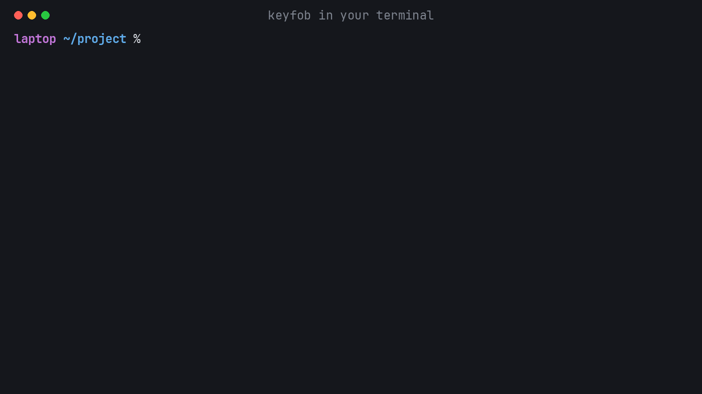

<div align="center">

# keyfob

**Keep your API keys and tokens out of your Claude Code conversations.**

Paste a token as `keyfob: <name> <token>` and the model sees `[stored in keyfob]`. When Claude needs a
key it asks for it by name, and you paste it into a field that redraws it as bullets. A command gets the
key for its own run, and nothing is exported into your shell.

[](https://github.com/yushiran/keyfob/releases)
[](https://github.com/anthropics/claude-code)
[](https://github.com/yushiran/keyfob/releases)
[](LICENSE)

![In Claude Code: a token pasted into the chat is stored and replaced by "[stored in keyfob]" before the model sees it; then Claude asks for the Semantic Scholar key by name, the /keyfob panel opens on it, the key goes into its field and is redrawn as bullets, and Claude carries on with keyfob run. All keys in the recording are made up.](assets/claude-code.gif)

</div>

## Install

Tell Claude Code:

```
Install https://github.com/yushiran/keyfob
```

It adds the plugin and asks you to restart. The keyfob binary comes with it: fetched once for your machine
and checked against the release's SHA-256.

<details>
<summary>What Claude runs</summary>

1. `claude plugin marketplace add yushiran/keyfob`
2. `claude plugin install keyfob@keyfob`
3. Ask the user to restart Claude Code. On first use the plugin's launcher downloads
   `keyfob-<target>.tar.gz` from the matching release and checks it against its `.sha256`.

</details>

On its own, for a server or a script: download `keyfob-<target>.tar.gz` from
[Releases](https://github.com/yushiran/keyfob/releases) and check it against its `.sha256`, or
`cargo install --git https://github.com/yushiran/keyfob`.

## Why

A token pasted into Claude Code becomes part of the conversation: the model reads it, and the transcript on
disk keeps it. A key exported in `~/.bashrc` sits in the environment of every process you start, Claude's
shell included, and one `env` or `cat .env` prints it into the conversation as well. keyfob keeps the value
in the OS keystore (or a `0600` file where there is none) and hands it to one command at a time, so the
model never needs to see it. What this covers, and what it does not, is [below](#what-it-protects-and-what-it-does-not).

## In Claude Code

- **Paste a token and it is gone before the model sees it.** Send `keyfob: s2-key <token>` on a line of its
  own (optionally followed by the variable name, e.g. `S2_API_KEY`) and the plugin stores the value before
  the message is kept; the model and the transcript get `keyfob: s2-key [stored in keyfob]`. A bare token in
  a format it recognises (OpenAI, Anthropic, GitHub, Hugging Face, Slack, Google, JWT, AWS access key IDs,
  Stripe live keys) is stored as `pasted-1`, `pasted-2`, … and replaced by `[keyfob:pasted-1]`. Anything
  else, such as a password or a value with a space, is sent as typed: use `/keyfob` for those.
- **Claude asks for a key by name.** It calls `keyfob_request`; `/keyfob` opens on that secret with a field
  that redraws what you paste as bullets, you press store, and a prompt tells Claude to go on. The value
  never becomes a message. You can open `/keyfob` yourself at any time.
- **A guard on Claude's Bash.** Commands that would print a secret (`keyfob get`, `env`, `echo $TOKEN`,
  reading the store), carry a literal token, or need a group's secrets without `keyfob run` are refused
  with the fix. It splits the command as a shell does, so a word inside a quoted grep pattern is not taken
  for `keyfob get`, `env` and the like.
- **Plugins say what they need.** A plugin lists its keys in a `keyfob.json`; keyfob finds it in every
  plugin enabled in your user settings, `/keyfob` shows what is missing and where to get it, and
  `keyfob check --live` asks each service a group declares a check for whether its keys still work.

## In your terminal



```sh
keyfob add openai-key --env OPENAI_API_KEY      # asks without echo; or paste `keyfob: openai-key <token>` in Claude Code
keyfob run openai-key -- python3 eval.py        # the script reads os.environ["OPENAI_API_KEY"]
keyfob run binance -- binance-cli spot ping     # a group a plugin declared: several variables at once
keyfob ls                                       # names, variables, who needs them; never values
keyfob check --live                             # complete? still accepted by the service?
keyfob doctor                                   # storage in use; plaintext secrets left in rc files or Claude settings
```

| Command | Does |
|---|---|
| `add <name> [--env VAR] [--note T] [--from-env VAR \| --stdin]` | store; asks on the terminal by default |
| `request <name> [--env VAR] --reason T [--obtain URL]` | record that a secret is wanted (no value) in `~/.config/keyfob/declarations.d/requested.json`; `/keyfob` lists it to add |
| `run <group\|name\|name=VAR>... -- <cmd>` | run `cmd` with those secrets in its environment (`env` is an alias) |
| `ls`, `check [--live]`, `which VAR`, `decls`, `doctor` | look, never show values; `--json` on all but `which` |
| `get <name>` | print a value: your terminal, your programs (the guard refuses it in Claude's Bash) |
| `rm <name>`, `rename <old> <new>` | the guard asks you before an `rm` Claude runs |
| `migrate --keychain-prefix <old/> [--names a,b] [--apply]` | preview, then with `--apply` copy Keychain items another tool wrote as `<old/><name>`, for the declared names or `--names` |
| `scrub` | stdin to stdout with every stored value replaced by `[keyfob:<name>]` |
| `capture`, `patterns`, `guard` | used by the Claude Code plugin |

**Where the values live.** The macOS Keychain, the Linux Secret Service, or, on a server or cluster with
neither, one `0600` file in a `0700` folder (what Claude Code itself does for its own login on Linux). Choose
with `KEYFOB_BACKEND` or `"backend"` in `~/.config/keyfob/config.json` (`keychain`, `secret-service`, `file`,
`auto`). On macOS keyfob goes through Apple's `/usr/bin/security`, so the Keychain's access list stays the same
across keyfob upgrades (no "allow access" dialog after each) and values travel on pipes, never in an argv.
One self-contained binary (Rust) for macOS (arm64, x86_64) and Linux (x86_64, aarch64; static musl builds).

## For plugin authors: keyfob.json

Put it at your plugin's root. keyfob reads it from every plugin enabled in your user settings
(`~/.claude/settings.json`); people add their own in
`~/.config/keyfob/declarations.d/`. Schema: [`plugins/keyfob/schema/keyfob.schema.json`](plugins/keyfob/schema/keyfob.schema.json).

```json
{
  "name": "scholar-tools",
  "secrets": {
    "s2-key": { "env": "S2_API_KEY", "description": "Semantic Scholar API key",
                "obtain": "https://www.semanticscholar.org/product/api#api-key-form" }
  },
  "groups": {
    "scholar": {
      "env": { "S2_API_KEY": "s2-key", "OPENALEX_API_KEY": "openalex-key" },
      "require_for": ["(^|\\s)python3?\\s+\\S*scholar_search\\.py"],
      "check": { "type": "http", "url": "https://api.semanticscholar.org/graph/v1/paper/CorpusId:1",
                 "headers": { "x-api-key": "${S2_API_KEY}" } }
    }
  },
  "guard": { "deny_paths": ["~/.config/scholar/keys.env"] }
}
```

A group may list `"optional": ["S2_API_KEY"]`: those variables are passed when stored and skipped when not,
so `keyfob run scholar --` runs whether or not the person has that key.

Your scripts read the variables; your docs say `keyfob run scholar -- <command>`. A local (stdio) MCP server
that needs a key is started as `keyfob run <name> -- <server command>` in its MCP config; credentials in a
remote server's headers are outside what keyfob can hand over.

## What it protects, and what it does not

- It keeps tokens out of rc files, settings files and the environment of every process. It keeps a token out of
  the conversation and the transcript when it is pasted as a `keyfob:` line or in a recognised format, or typed
  into `/keyfob`, and the guard refuses the common commands that would print one.
- It does not filter what a command run under `keyfob run` prints: a script that prints its key puts it in the
  conversation. A literal token that Claude writes into a Bash command is already in the transcript when the
  guard refuses it; the refusal stops it from running, not from being written.
- The guard is a seatbelt against mistakes, not a sandbox: a command written to get around it can. It fails open
  if it cannot read its input.
- Whatever runs as you can read what you can read: on a server the file store protects against other users, not
  against root; on macOS any program running as you can read keyfob's items through `/usr/bin/security` without
  a dialog, and the Keychain asks only apps that read it directly.
- A pasted `keyfob:` line (a token without spaces) or a token in a recognised format is stored and replaced
  before the message enters the session; anything else is sent as typed. Claude Code's own prompt history file
  (`~/.claude/history.jsonl`) is written by the terminal, and is not covered unless that turns out otherwise on
  your version: check with a dummy token, and use `/keyfob` (its input never becomes a message) when it matters.
- The `/keyfob` field redraws its content as bullets after each keystroke or paste, so what you type can show for
  a moment before it is redrawn.

## Develop

`cargo test` (add `KEYFOB_TEST_KEYCHAIN=1` on macOS for the Keychain round trip), `claude plugin validate
plugins/keyfob`, `claude plugin test plugins/keyfob`. In a checkout the launcher uses `target/release` or
`target/debug`. Releases: bump `version` in `Cargo.toml`, `plugin.json`, `VERSION=` in
`plugins/keyfob/bin/keyfob` and the README badge, run `cargo build` so `Cargo.lock` follows (the release build
uses `--locked`), commit, then push a `v<version>` tag.

Licensed under [CC BY-NC-SA 4.0](LICENSE): free to use, share and adapt with attribution, for non-commercial purposes, under the same license. Version 0.1.0 was published under MIT.
